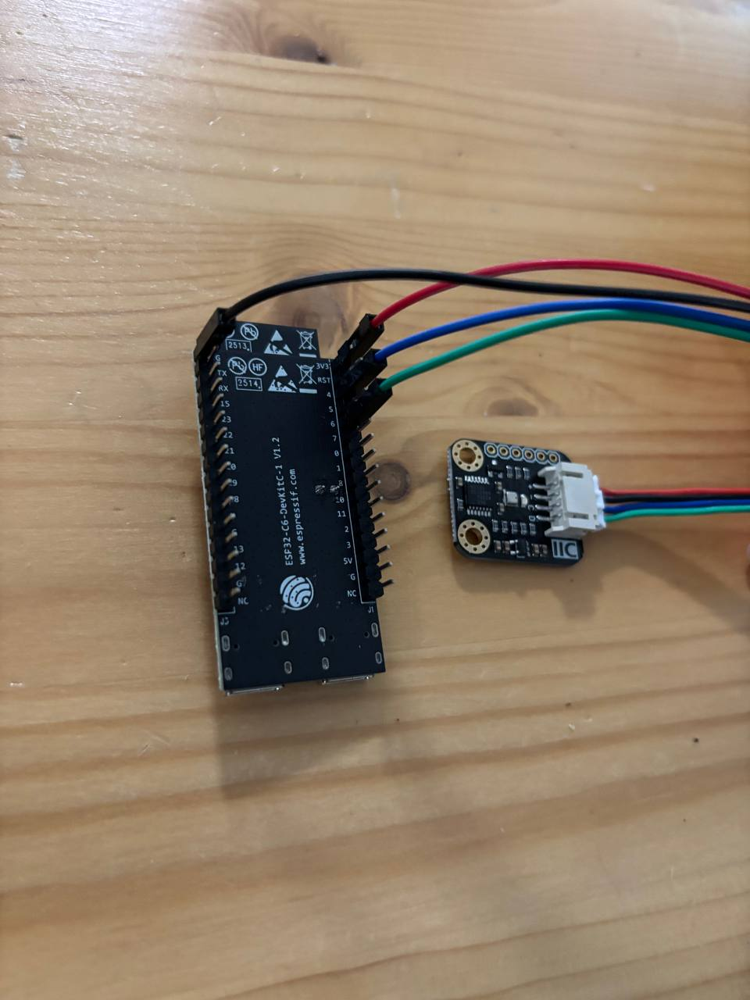

# TYTO ESP32 Sensor Node

    

> **⚠️ IMPORTANT:** This is the second part of the TYTO project. Please ensure you have set up the [TYTO API](https://github.com/TytoAlbaGuttata/tyto-api) on your Raspberry Pi before proceeding.

## Hardware & Wiring
This node uses an ESP32 (`esp32-c6-devkitc-1`), a BME280 sensor, and a 0.96" I2C OLED display (SSD1306) to collect and display environmental data locally.

Using a breadboard, connect both the BME280 sensor and the OLED display in parallel to the ESP32 following this pinout:
* **VCC / + (Red):** 3v3
* **GND / - (Black):** GND
* **SCL / C (Blue):** Pin 4
* **SDA / D (Green):** Pin 6



## Prerequisites
You need an IDE compatible with PlatformIO. The recommended setup for this project is **CLion** with the PlatformIO plugin installed.

## Firmware Configuration
Before flashing the board, you must provide your network and API details. 
> **Note on Wi-Fi:** The ESP32 only supports 2.4 GHz networks. Ensure your SSID corresponds to a 2.4 GHz network, as it will not be able to connect to a 5.0 GHz one.

Create a `src/secrets.h` file with the following content:
```cpp
const char* WIFI_SSID = "WIFI_NAME";
const char* WIFI_PASSWORD = "WIFI_PASSWORD";
const char* API_URL = "http://<YOUR_PI_IP>:8000/api/measurements";
const char* API_SECRET = "YOUR_API_SECRET";
```

## Flashing & Usage

1. Connect the ESP32 to your computer using a USB-C cable. Make sure to plug it into the port labeled **UART**.
2. Using CLion:
* Click the **Hammer icon** in the toolbar to build the project.
* Click the **Green play arrow** to flash the firmware to your connected ESP32.

Once connected to the Wi-Fi, the ESP32 reads the BME280 sensor, updates the OLED screen locally, and sends a POST request with the data to the API every 15 minutes.

## Contributing

This is a completed personal project. Contributions, issues, and feature requests are not accepted. However, you are completely free to fork the repository and modify it for your own personal use.

## License

This project is licensed under the MIT License - see the [LICENSE](LICENSE) file for details.
